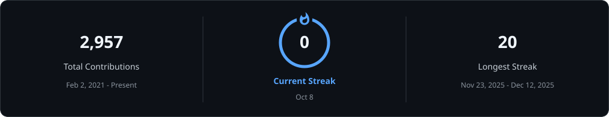

<h1 align="center">Hi 👋, I'm Youssef Mohamed Hedefa</h1>

<h3 align="center">Software Engineer | Building Reliable, Scalable & User-Focused Products</h3>

Software Engineer with 2+ years of professional experience building, maintaining, and scaling production software products.
Experienced across the software development lifecycle, including system architecture, feature development, API integration,
real-time communication, performance optimization, CI/CD, production debugging, and deployment.

---

## 👨‍💻 About Me

- 💻 Software Engineer with hands-on experience delivering production software products
- 🏗️ Experienced with software architecture, maintainable codebases, and scalable application design
- 📱 Strong experience in cross-platform and mobile application development
- 🌐 Experienced with RESTful APIs, backend integrations, WebSockets, real-time systems, and data synchronization
- ⚡ Work with asynchronous and event-driven programming using streams and real-time communication
- 🔥 Experienced with Firebase services, authentication, databases, notifications, remote configuration, and cloud integrations
- 💳 Integrated payment systems, In-App Purchases, Ads, Apple Pay, Google Pay, Stripe, and regional payment gateways
- 📴 Experienced in offline-first systems, caching, synchronization, and low-connectivity scenarios
- 🔄 Build and maintain CI/CD pipelines and production release workflows
- 🛠️ Handle production debugging, crashes, deployment issues, and release problems
- 👥 Perform code reviews, support junior developers, and collaborate with engineering, QA, design, and product teams
- 🌍 Worked on software products across logistics, fintech, ERP, real estate, e-commerce, commodities, and service marketplaces

---

## 🛠️ Technologies & Tools

---

## ⚙️ Technical Expertise

### 🧩 Software Engineering

`OOP` `SOLID Principles` `Design Patterns`  
`Clean Architecture` `MVVM` `MVC`  
`Data Structures & Algorithms`  
`Code Review` `Refactoring` `Technical Debt Reduction`

### 💻 Programming Languages

`Dart` `Kotlin` `Java` `Swift`  
`JavaScript` `Python` `C#`

### 📱 Mobile Development

`Flutter` `Cross-Platform Development`  
`Android Development` `iOS Fundamentals`  
`Responsive UI`  
`Bloc` `Cubit` `Provider` `Riverpod`

### 🌐 Web Development

`React` `JavaScript`  
`Responsive Web Development`  
`REST API Integration`  
`Frontend Architecture`

### 🌐 APIs & Real-Time Systems

`RESTful APIs` `Dio` `Retrofit`  
`WebSockets` `Dart Streams`  
`Real-Time Data Synchronization`  
`Postman` `Swagger`

### ☁️ Backend & Cloud

`Node.js` `MongoDB`  
`Firebase Authentication` `Firestore`  
`Cloud Messaging` `Remote Config`  
`Cloud Functions` `Firebase Storage`

### 💳 Payments & Product Integrations

`Stripe` `Fawaterak` `Fatora`  
`Apple Pay` `Google Pay`  
`In-App Purchases` `Ads`  
`Push Notifications` `Localization`

### 📴 Reliability & Performance

`Offline-First Architecture`  
`Caching` `State Synchronization`  
`Performance Optimization`  
`Production Debugging`  
`Crash & Release Issue Resolution`

### 🚀 CI/CD & Release Engineering

`GitHub Actions` `Codemagic`  
`Firebase App Distribution` `TestFlight`  
`Google Play` `App Store`  
`Git` `GitHub`

### 🤝 Engineering Collaboration

`Agile/Scrum` `Jira` `Trello`  
`Code Review` `Technical Communication`  
`Mentoring` `Cross-Functional Collaboration`

---

## 🚀 Selected Production Work

### Gold Fawry — 50,000+ Downloads

Commodities and financial utilities platform developed for the MENA market.

- Core product development
- Real-time data handling
- Offline-first workflows
- Caching and synchronization
- Financial calculators
- Ads and In-App Purchases
- CI/CD and production releases

---

### FastEx — 1,000+ Downloads

Multi-modal logistics platform supporting different transportation and delivery workflows.

- Ride-hailing
- Parcel delivery
- Inter-city shipping
- Live trip tracking
- Dispatch workflows
- Payments
- Real-time synchronization
- Push notifications

---

### Mangoul — 6,000+ Combined Downloads

Two-sided logistics marketplace consisting of customer and service-provider applications.

- Real-time bidding workflows
- User and provider platforms
- Cross-application notification routing
- Legacy code modernization
- Production feature development
- Technical debt reduction

---

### Rubbish — 500+ Downloads

Service scheduling and operations platform.

- Fixed and on-demand scheduling
- Backend synchronization
- Notification-driven workflows
- Production system maintenance

---

### Swag — Real Estate Platform

Production real estate product covering both mobile and web experiences.

- Customer mobile application
- Web dashboard
- REST API integrations
- Push notifications
- Administrative workflows
- CI/CD
- Android and iOS releases

---

## 💡 Selected Projects

### 🕌 Mo3een — Worship Assistant

Offline-first application featuring:

- Quran
- Prayer times
- Qibla direction
- Athkar & Tasbeeh
- Device sensors
- Location services
- Scheduled notifications
- Local persistence

---

### 🌾 7asad — Graduation Project

Agricultural marketplace built as my university graduation project.

- Marketplace workflows
- Real-time chat
- Firebase OTP authentication
- Machine-learning crop disease detection
- Firebase integrations

---

## 🧠 Engineering Experience

My work goes beyond implementing application screens and features. I regularly work on:

- Designing and maintaining software architecture
- Refactoring legacy systems
- Investigating production issues
- Debugging application and integration problems
- Reviewing code
- Reducing duplicated logic and technical debt
- Managing releases and deployments
- Collaborating with backend engineers
- Working with QA, UI/UX, and product teams
- Supporting and mentoring junior developers

---

## 📊 GitHub Activity

Updated daily · Activity statistics reflect accessible GitHub data. Language percentages describe repository code, not proficiency.

---

## 📫 Let's Connect

I'm interested in software engineering, system design, application architecture,
real-time systems, scalable products, and solving challenging engineering problems.

